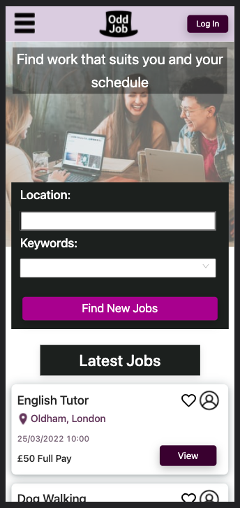
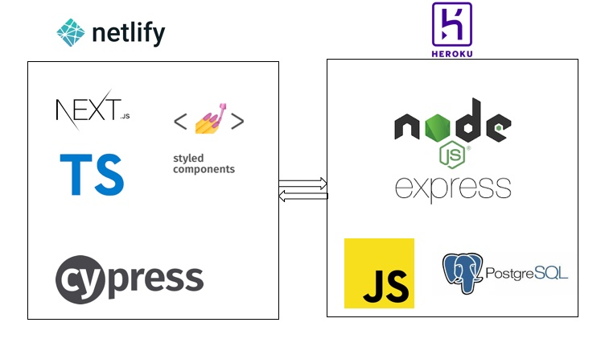

# Odd Job App

## About

Odd job is platform that brings together people who want to earn cash by doing jobs in their spare time with people who need help with odd jobs.
Odd job app has been created by a team of 6 creators as part of a four week project at School of code [School of Code](https://www.schoolofcode.co.uk/).

## Problem Statement

University students want to earn money by doing work that suits their schedule, but there is not a central platform for them to find odd jobs.

### Tech Stack

## Meet the team

Abdullahi Ali [@abdullahiali89](https://github.com/abdullahiali89)  
Ana-Maria Barrow [@ana-maria-b](https://github.com/ana-maria-b)  
Guy Robbins [@Guy-Robbins](https://github.com/Guy-Robbins) 
Sahara Rai [@SaharaRai](https://github.com/SaharaRai) 
Ted Phillips [@TedPhillips1](https://github.com/TedPhillips1) 
William Calderbank [@WCalderbank](https://github.com/WCalderbank) 
